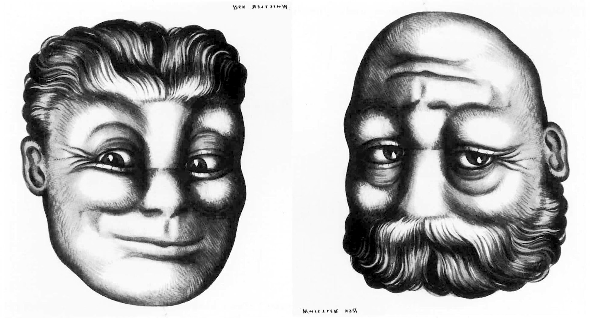
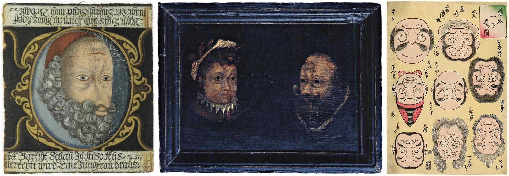
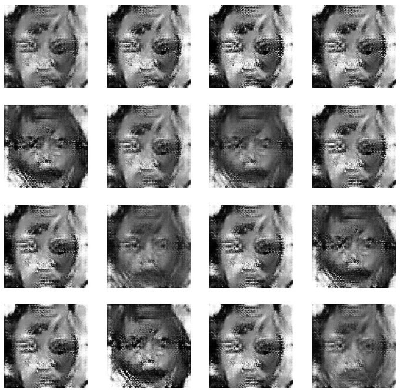
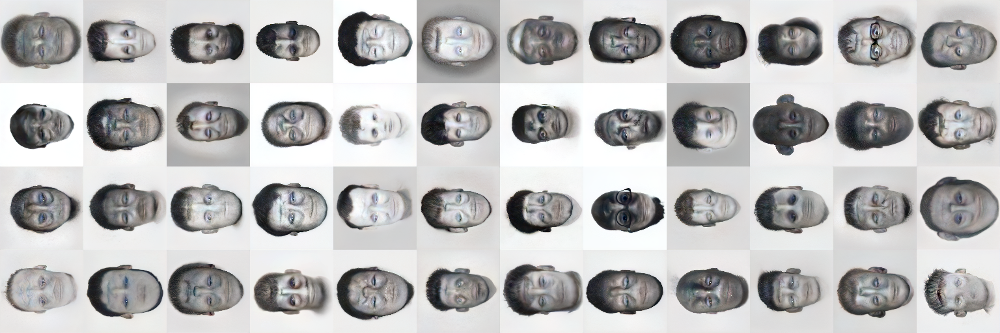

# Ambigrammatic Figures

*55 Grotesque Ambigrams By Golan Levin with Lingdong Huang, 05/05/2020*

 *Ambigrammatic Figure #0073*

---
### Overview

<table>
<tbody>
<tr>
<td width="33%"></td>
<td width="34%"></td>
<td width="33%"></td>
</tr>

<tr>
<td width="33%"></td>
<td width="34%"></td>
<td width="33%"></td>
</tr>

</tbody>
</table>

These faces are “ambigrams”: images that are legible both upside-down and right-side up. Created with a machine learning system, they may be displayed in any orientation. In this project, a collection of 55 such ambigrammatic faces have been generated in high resolution, and printed as a limited edition deck of poker-sized cards. 

In the text of the deck's accompanying packaging, collectors of this artwork are encouraged to devise their own activities with these cards: 

> * *Sort the cards from most to least _________.*
> * *Give names to the depicted. Write the personal motto or epitaph for each half of their duality.*
> * *Select groups of nine cards, and organize them according to the Nine Alignments (chaotic neutral, lawful evil, etc.).*

---
### About These Images

 *Reversible Faces* (1931-32) by Rex Whistler

Some of the best known ambigrammatic faces are the “[Upside-down Pictures](https://ukiyo-e.org/image/mfa/sc168251)” (*Dôke jôgemi no zu*, 「道化上下見ノ図」 c. 1861) by Edo illustrator Utagawa Yoshitora (active 1836–1887), and a series of “[Reversible Faces](https://commons.wikimedia.org/wiki/File:Rex_Whistler_-_Reversible_Face_-_Mayor_%26_Judge_1930.jpg)” (c. 1931), published posthumously by the British artist, Reginald John “Rex” Whistler (1905–1944). Interested readers are referred to additional examples in George Tscherny’s 2004 book, “[Changing Faces](https://www.amazon.com/Changing-Faces-George-Tscherny/dp/B000W7M2ZW)”, and Al Seckel’s 2006 book “[SuperVisions: Topsy-Turvy Optical Illusions](https://www.amazon.com/SuperVisions-Topsy-Turvy-Illusions-Al-Seckel/dp/1402718322)”.

 L-R: anonymous Swiss painting (18th C.); anonymous English painting (19th C.); *Upside-down Pictures* (1861) by Utagawa Yoshitora

In the eighteenth and nineteenth centuries, bivalent face illusions were often used to depict uncomplicated dualities, such as young-old, good-evil, or blessed-damned. The faces in the *Ambigrammatic Figures* deck reflect the moral ambiguities of a darker and more uncertain time, marked by ecological crisis, misinformation, identitarianism, patriarchal authoritarianism, and the social unrest of a polity divided against itself.

---
### Technical Development

 An initial attempt to develop *Ambigrammatic Figures*, with a custom GAN

Our initial attempt to implement *Ambigrammatic Figures* entailed the development of a custom generative adversarial network (GAN). This GAN was based on an introductory MNIST GAN, and trained from scratch on approximately 200 hand-selected face images. The GAN was algorithmically modified to generate faces that looked credible in both orientations. In particular, the GAN's discriminator evaluated the generator’s output both upside-down and right-side-up, and produced a score that was a function of both. Unfortunately, the results of this techniqiue were low-resolution, plagued by artifacts, and failed to converge well.

 Some of the *Ambigrammatic Figures* which appear in the card deck

Ultimately, our *Ambigrammatic Figures* were synthesized with the [StyleGAN2](https://github.com/NVlabs/stylegan2) generative adversarial network, using pre-trained weights from the [Flickr-Faces-HQ Dataset](https://github.com/NVlabs/ffhq-dataset) (FFHQ), and enhanced using the [waifu2x](https://github.com/nagadomi/waifu2x) super-resolution library.

Our work uses the StyleGAN2 "[projection](https://towardsdatascience.com/stylegan2-projection-a-reliable-method-for-image-forensics-700922579236)" technique, in which the GAN attempts to find a given face in its latent space, starting its search from a “generic” “neutral” face located at the origin. We provide the StyleGAN an upside-down face as a query — and the projector tries its best to find it, but can never serve a perfect match, because it has only been trained on exclusively right-side-up faces. In short, the GAN projector finds upside-down faces in the latent space (or "generatable manifold") of right-side up faces. Through the struggle to match an upside-down face using right-side-up ones, the GAN tends to converge on a face that can be looked at both ways.  

---
### Acknowledgments

The *Ambigrammatic Figures* were developed by [Golan Levin](http://flong.com/archive/) and [Lingdong Huang](https://lingdong.works/) at the [Frank-Ratchye STUDIO for Creative Inquiry](https://studioforcreativeinquiry.org/), Pittsburgh, during the COVID-19 pandemic of spring 2020.

This project was realized in part through support from Nvidia Corporation and the [a2p curatorial initiative](https://a2p.bitmark.com/v2/artworks) by Casey Reas et al. The animated GIFs and reverse side of the cards were generated with [Processing](http://processing.org), an open source toolkit for the arts.

The *Ambigrammatic Figures* imagery, card deck, and other media developed for this project are presented under a Creative Commons Attribution-NonCommercial-ShareAlike 4.0 International License ([CC BY-NC-SA 4.0](https://creativecommons.org/licenses/by-nc-sa/4.0/)).

We acknowledge our debt to the individuals whose faces alchemically influenced our machine's hallucinations. No identification with actual persons is intended or should be inferred, and any resemblance to actual persons, living or deceased, is purely coincidental.

Additional thanks to: Kyle McDonald, Claire Hentschker, Omer Shapira, Mikael Christensen, roadrunner01 (@ak92501), Tero Karras et al. (NVlabs), C. Nagadomi, NIST, Casey Reas, Imin Yeh, Andrea Boykowycz, and the staff of the Frank-Ratchye STUDIO for Creative Inquiry at Carnegie Mellon University.

---
### References

Alex, Vlad (Merzmensch). *StyleGAN2 Projection: A Reliable Method for Image Forensics?* towardsdatascience.com, 15 January 2020. [https://towardsdatascience.com/stylegan2-projection-a-reliable-method-for-image-forensics-700922579236](https://towardsdatascience.com/stylegan2-projection-a-reliable-method-for-image-forensics-700922579236)

Christensen, Mikael. *Colab Notebook for NVIDIA's StyleGAN2.* [https://colab.research.google.com/drive/1ShgW6wohEFQtqs_znMna3dzrcVoABKIH#scrollTo=4_s8h-ilzHQc](https://colab.research.google.com/drive/1ShgW6wohEFQtqs_znMna3dzrcVoABKIH#scrollTo=4_s8h-ilzHQc)

Kim, Scott. *Inversions*. 1996. [https://www.amazon.com/Inversions-Scott-Kim/dp/1559532807](https://www.amazon.com/Inversions-Scott-Kim/dp/1559532807)

Seckel, Al. *SuperVisions: Topsy-Turvy Optical Illusions*. 2006. [https://www.amazon.com/SuperVisions-Topsy-Turvy-Illusions-Al-Seckel/dp/1402718322](https://www.amazon.com/SuperVisions-Topsy-Turvy-Illusions-Al-Seckel/dp/1402718322)

Tscherny, George. *Changing Faces.* 2004. [https://www.amazon.com/Changing-Faces-George-Tscherny/dp/B000W7M2ZW](https://www.amazon.com/Changing-Faces-George-Tscherny/dp/B000W7M2ZW)