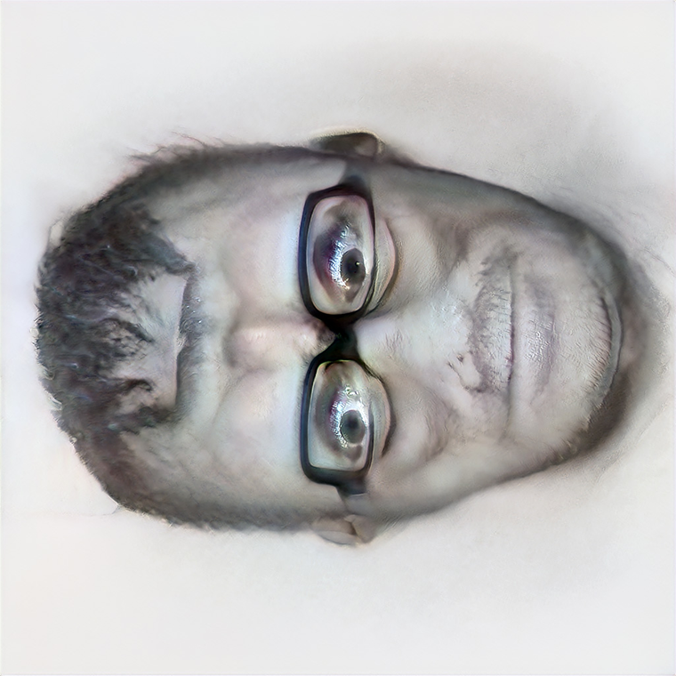
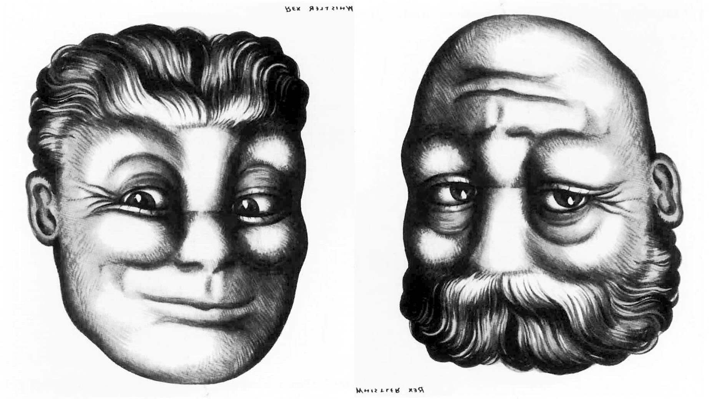
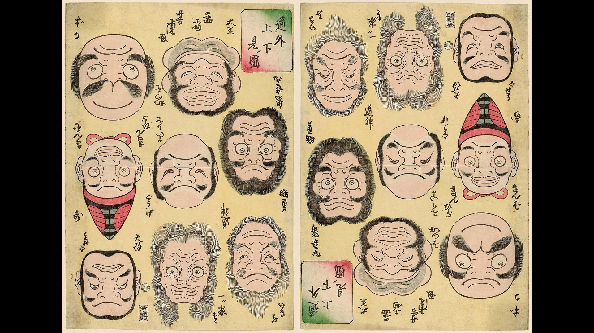
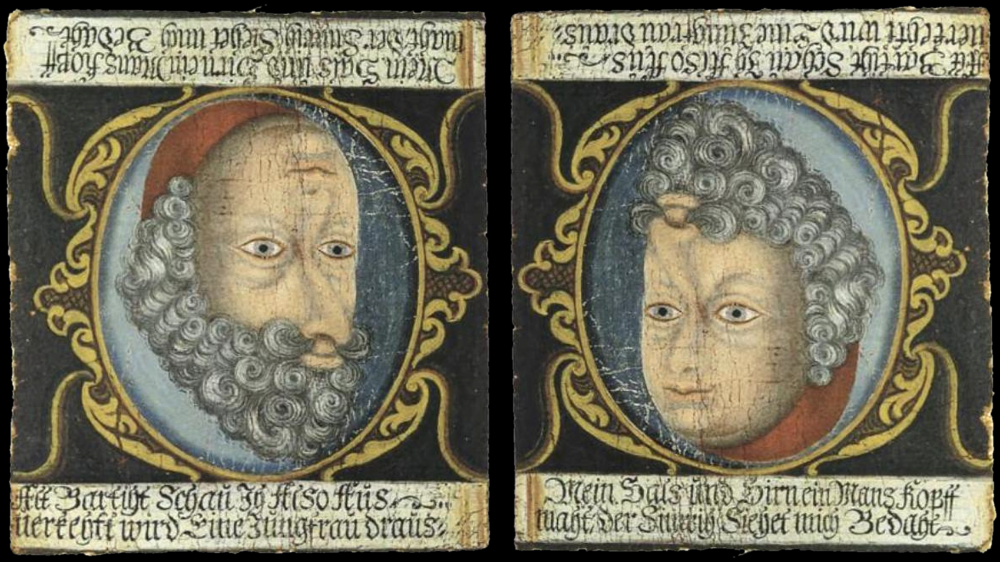
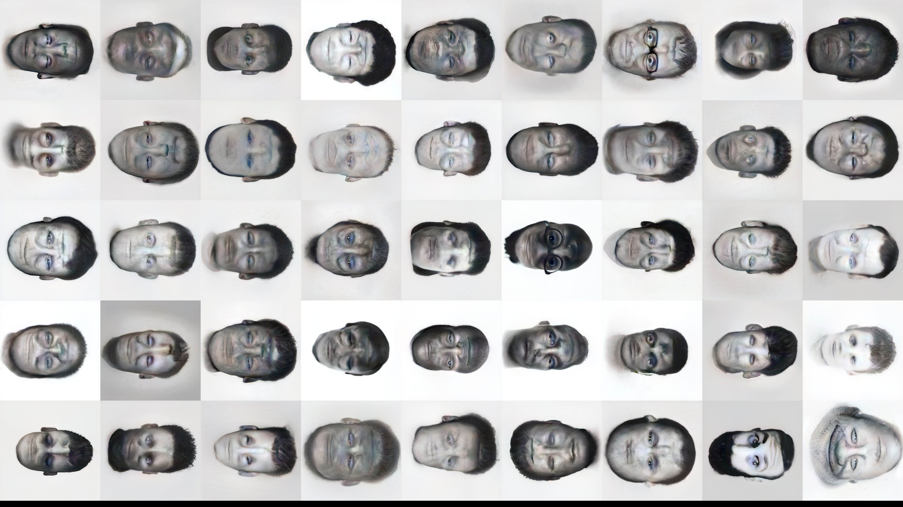
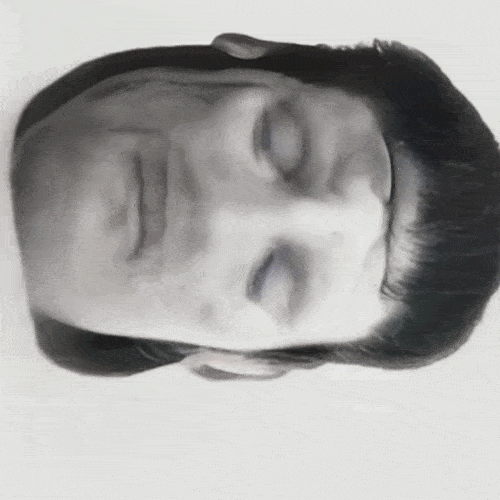
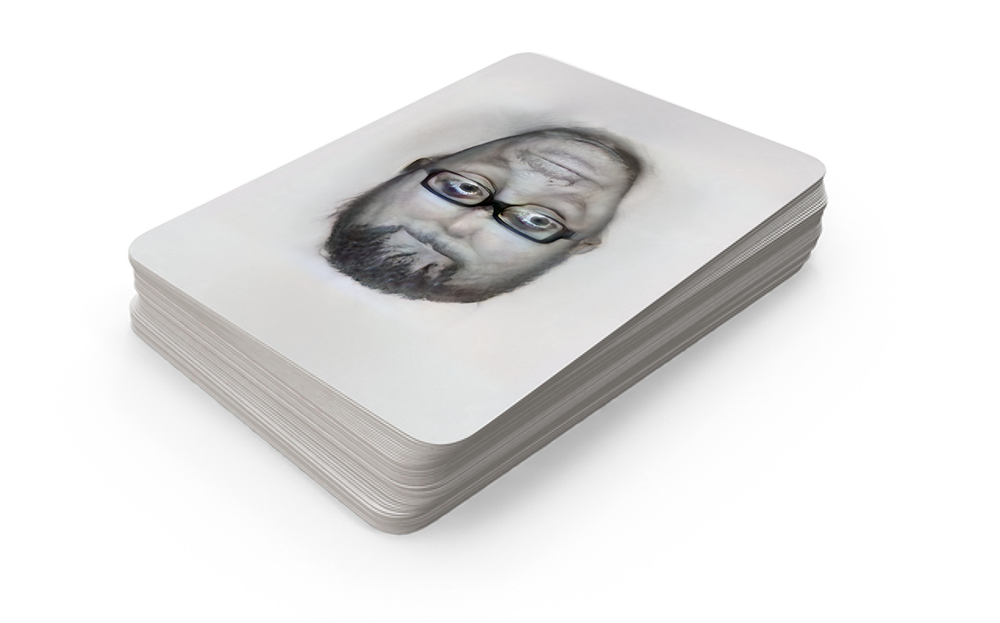
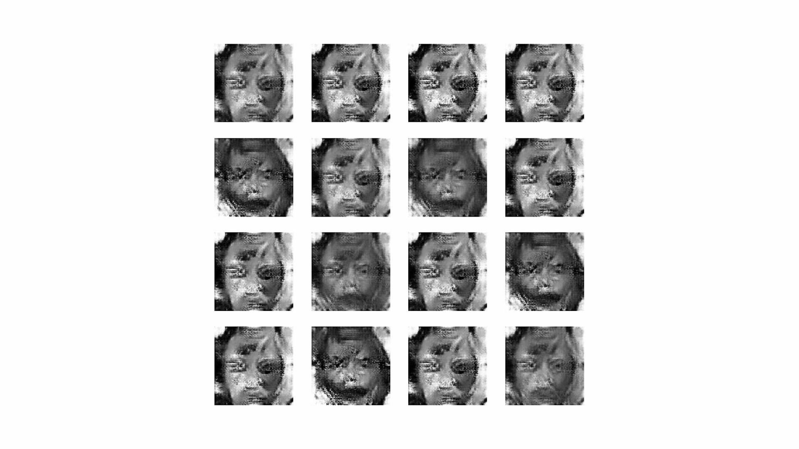
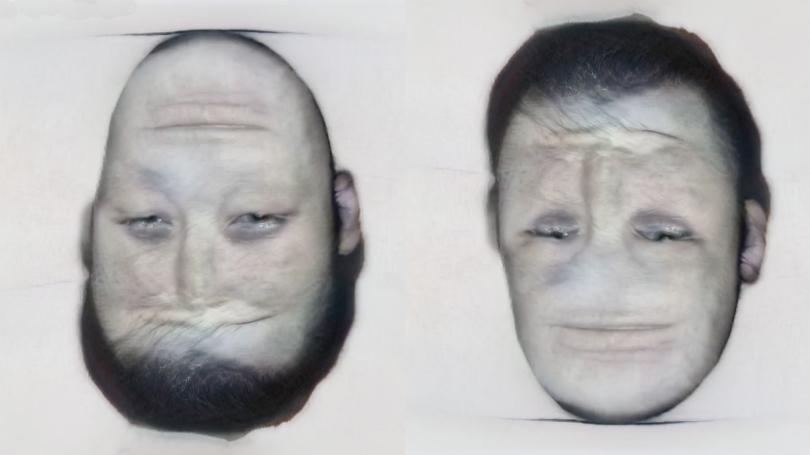

# Ambigrammatic Figures

*55 Grotesque Ambigrams By Golan Levin with Lingdong Huang, 05/05/2020*

This video presents documentation of "Ambigrammatic Faces", a variable-format, generative artwork by Golan Levin and Lingdong Huang. Developed during the COVID-19 pandemic using artificial intelligence techniques, the project operates as an expressive meditation on themes of identity, illness, and social unrest. 

### Overview

<table>
<tbody>
<tr>
<td width="33%"></td>
<td width="34%"></td>
<td width="33%"></td>
</tr>

</tbody>
</table>

These faces are “ambigrams”: images that are legible both upside-down and right-side up. Created with a machine learning system, they may be displayed in any orientation. In this project, a collection of 55 such ambigrammatic faces have been generated in high resolution, and presented in a variety of different formats. 

Some of the best-loved reversible faces are a series of drawings by the British artist, “Rex” Whistler, created in 1931 and published after his death,

and a collection of playful “Upside-down Pictures”, created circa 1861, by the Japanese illustrator Utagawa Yoshitora. 

But the illusion has older roots. In the eighteenth and nineteenth centuries, bivalent face illusions were often used to depict uncomplicated dualities, such as young-old, male-female, good-evil, or blessed-damned. 

<table>
<tbody>

<tr>
<td width="33%"></td>
<td width="34%"></td>
<td width="33%"></td>
</tr>

</tbody>
</table>

The faces in our *Ambigrammatic Figures* project reflect the moral ambiguities of a darker and more uncertain time — marked by ecological crisis, misinformation, identitarianism, patriarchal authoritarianism, insurrection, and the social unrest of a polity divided against itself.

### Presentation 

The *Ambigrammatic Faces* project is a variable-format work. When the faces are presented as *still images*, we orient them sideways, to preserve their ambiguity. 

When presented *dynamically*, we present the faces as spinning loops, as shown earlier, or in bivalent videos, puppeteered by facial motion capture recordings and reanimated by the Deep Nostalgia image warping algorithm. 

The faces are also presented in a tangible, open-ended, interactive format as a editioned deck of printed poker-sized cards, currently in production. In the text of the deck's accompanying packaging, collectors of this artwork are encouraged to devise their own activities with these cards, such as sorting the cards according to subjective criteria, or giving names and epitaphs to the depicted.  

### Technical Implementation 

Our initial attempt to implement *Ambigrammatic Figures* entailed the development of a custom generative adversarial network, or GAN, algorithmically modified to generate faces that looked credible in both orientations. In particular, the GAN's discriminator evaluated the generator’s output both upside-down and right-side-up, and produced a score that was a function of both. Unfortunately, the results of this techniqiue were plagued by artifacts, and failed to converge well.

Ultimately, our *Ambigrammatic Figures* were synthesized with a "projection" technique, in which a GAN attempts to find a given face in its latent space, starting its search from a “generic” “neutral” face located at the origin. We provide the StyleGAN network with an upside-down face as a query — and the projector tries its best to find it, but can never serve a perfect match, because it has only been trained on exclusively right-side-up faces. In short, the GAN projector finds upside-down faces in the latent space—or "generatable manifold"—of right-side up faces. Through the struggle to match an upside-down face using right-side-up ones, the GAN tends to converge on a face that can be looked at both ways.  

---
### Acknowledgments

The *Ambigrammatic Figures* were developed by Golan Levin and Lingdong Huang at the Frank-Ratchye STUDIO for Creative Inquiry, Pittsburgh, during the COVID-19 pandemic of spring 2020. This project was realized in part through inadvertent support from Nvidia Corporation and the a2p curatorial initiative by Casey Reas. 

We acknowledge our debt to the individuals whose faces alchemically influenced our machine's hallucinations. No identification with actual persons is intended or should be inferred, and any resemblance to actual persons, living or deceased, is purely coincidental.

Additional thanks to: Kyle McDonald, Claire Hentschker, Omer Shapira, Mikael Christensen, roadrunner01 (@ak92501), Tero Karras et al. (NVlabs), C. Nagadomi, NIST, Casey Reas, Imin Yeh, Andrea Boykowycz, and the staff of the Frank-Ratchye STUDIO for Creative Inquiry at Carnegie Mellon University.
